# Запись и воспроизведение действий в браузере

Цель: 
- Упростить процесс записи действий выполняемых при настройке устройств  
- Быстрое повторное воспроизведение действий  
- Использовать записанных действий для формирования тестовых сценариев и автотрестов  
- Ускорение процесса воспроизведения проблем и ошибок  

## Инструмент: Katalon Recorder  
#### Установка:
Устанавливается как расширение для браузеров Chrome и FireFox: https://www.katalon.com/katalon-recorder-ide/
#### Дополнительная информация:
https://docs.katalon.com/katalon-studio/videos/working_with_katalon_recorder.html  
https://docs.katalon.com/katalon-recorder/docs/selenese-selenium-ide-commands-reference.html  
#### Пример использования:
1. Производим разворачивание тестируемой системы с настройками по умолчанию  
> Важно!!! Для корректного воспроизведения записанных действий на разных компьютерах и в разных развернутых системах, их настройки должны совпадать. По умолчанию используем базовые настройки после установки системы.  
>
2. В браузере запускается расширение Katalon Recorder  
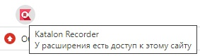
3. Создается новый тестовый сценарий с именем, которое описывает производимые настройки  
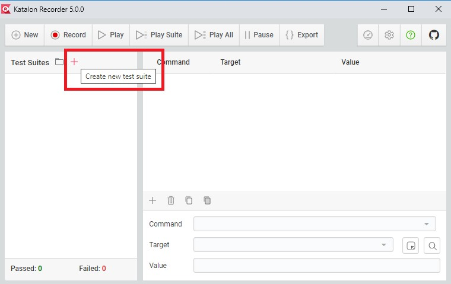
В результате должен быть создан новый тестовый сценарий
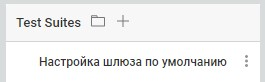
4. Добавляется описание тестового сценария и тестового окружения  
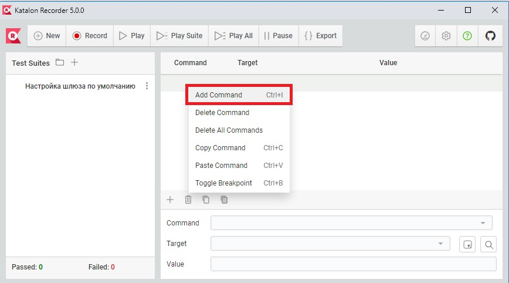
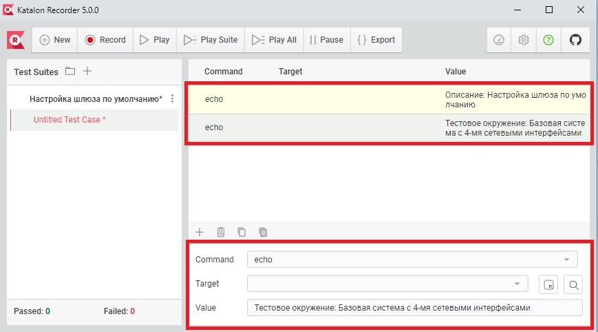
echo – команда, которая выводит информационное сообщение в лог, можно использовать как комментарий к действия скрипта.  
5. Записываем производимые действия на странице  
Запускаем запись наших действий:
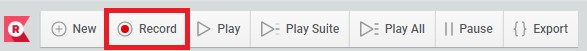
В браузере выполняем настройку:
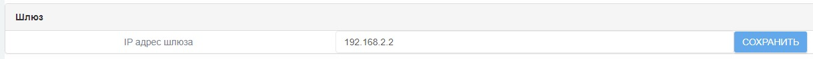
Останавливаем запись наших действий:

6. Производим удаление избыточных действий и добавляем комментарии к действиям  
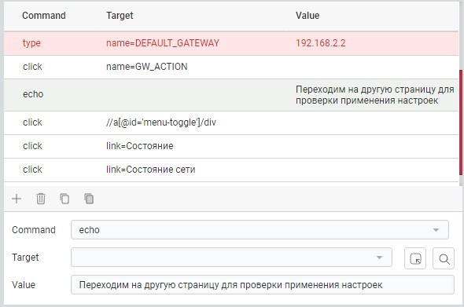
Важно!!! Если поле для настроек находится в не видимости браузера (отсутсвует рендеринг изображения), то может возникать ошибка:  

Для ее исправления необходимо вручную добавить команду focus:
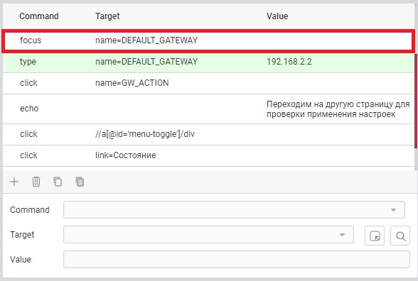
focus – команда позволяющая переходить на выбранный элемент
7. Сохранение записанных действий  
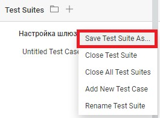
Сохраняем в формате html:
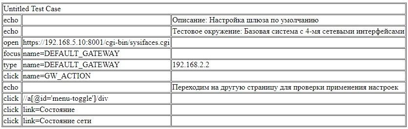
8. Загрузка записанных действий  
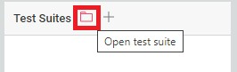
9. Воспроизведение записанных действий  
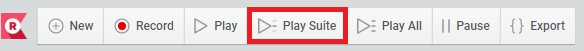
При необходимости можно уменьшить скорость воспроизведения действий:  

10. Экспорт в системы автоматизации тестирования  
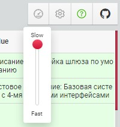
