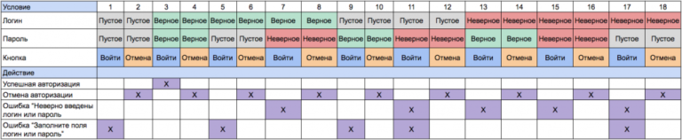

# Техники тест-дизайна

## Эквивалентное Разделение (Equivalence Partitioning)
Это техника, при которой функционал (часто диапазон возможных вводимых значений) разделяется на группы эквивалентных по своему влиянию на систему значений.

**Пример:**  
Есть диапазон допустимых значений от 1 до 10, выбирается одно верное значение внутри интервала (например, 5) и одно неверное значение вне интервала - 0.

## Анализ Граничных Значений (Boundary Value Analysis)
Это техника проверки поведения продукта на крайних (граничных) значениях входных данных. BVA может применяться к полям, записям, файлам, или к любого рода сущностям имеющим ограничения.

**Пример:**  
Есть диапазон допустимых значений от 1 до 10, в качестве значений для позитивного тестирования берется минимальная и максимальная границы (1 и 10), и значения больше и меньше границ (0 и 11).

## Доменный анализ (Domain Analysis Testing)
Это техника основана на разбиении диапазона возможных значений переменной на поддиапазоны, с последующим выбором одного или нескольких значений из каждого домена для тестирования.

## Предугадывание ошибки (Error Guessing - EG)
Это когда тестировщик использует свои знания системы и способность к интерпретации спецификации на предмет того, чтобы «предугадать» при каких входных условиях система может выдать ошибку.

## Причина / Следствие (Cause / Effect - CE)
Подразумевается ввод условий, для получения ответа от системы (следствие).

## Сценарий использования (Use Case Testing)
Use Case описывает сценарий взаимодействия двух и более участников (как правило - пользователя и системы).

## Исчерпывающее тестирование (Exhaustive Testing - ET)
Подразумевается проверка всех возможные комбинации входных значений. На практике не используется.

## Попарное тестирование (Pairwise Testing)
Это техника формирования наборов тестовых данных из полного набора входных данных в системе, которая позволяет существенно сократить общее количество тест-кейсов. Метод обнаружения дефектов с использованием комбинационного подхода, который основан на наблюдениях о том, что большинство дефектов вызвано взаимодействием не более двух факторов (дефекты, которые возникают при взаимодействии трех и более факторов, как правило менее критичны). Следовательно, выбирается пара двух тестовых параметров, и все возможные пары этих двух параметров отправляются в качестве входных параметров для тестирования.  
Для Pairwise testing используют алгоритмы, которые базируются на построении ортогональных матриц, или алгоритмы All-Pairs.  
Данная техника тест-дизайна относится к статическим способам тестирование и используется в том случае, когда мы имеем дело с большим количеством входных данных, следовательно, исчерпывающие тестирование является недостижимым.  
Используется для тестирования, например, фильтров, сортировок.  

**Пример:**  
Пусть у нас есть 2 значения - X, Y.  
Для них существуют следующие комбинации: (x,x),(x,y),(y,x),(y,y).  
Добавим к ним 3 входных параметра 1, 2, 3, которые принимают значения X и Y.  
Все возможные комбинации предствлены в таблице:  
|   | 1 | 2 | 3 |
| - | - | - | - |
| 1 | x | x | x |
| 2 | x | x | y |
| 3 | x | y | x |
| 4 | y | x | x |
| 5 | y | y | x |
| 6 | y | x | y |
| 7 | x | y | y |
| 8 | y | y | y |

Для того, чтобы построить ортогональную матрицу для этого примера необходимо сделать так, чтобы два любые столбика (в нашем случае это параметры 1, 2 и 3) содержали в себе все возможные комбинации только один раз.  
Таким образом, ортогональная матрица для нашего случая будет выглядеть таким образом:  
|   | 1 | 2 | 3 |
| - | - | - | - |
| 1 | x | x | x |
| 2 | x | y | y |
| 3 | y | x | y |
| 4 | y | y | x |

Как мы видим, в столбцах 1 и 2 есть все возможные комбинации: (x,x),(x,y),(y,y),(y,x).  
Для других пар столбцов это правило работает аналогично:  
2 и 3: (x,x),(x,y),(y,y),(y,x)  
1 и 3: (x,x),(x,y),(y,y),(y,x)  

## Тестирование с помощью алгоритма All-Pairs
**Аналогичен Попарное тестирование (Pairwise Testing).**  
Аll-pairs testing - комбинаторный метод тестирование программного обеспечения, который проверяет все возможные дискретные комбинации параметров для каждой пары входных параметров системы. Исходя из этого, мы получим меньшее число комбинаций, чем при использовании ортогональных матриц.  

**Пример:**
Есть форма в которой могут быть указаны следующие поля:  
| Параметр | Возможные значения |
| - | - |
| Поле 1 | x1, y1 |
| Поле 2 | x2, y2 |
| Поле 3 | x3, y3, z3 |
| Поле 4 | x2, y2 |
| Поле 5 | x2, y2 |
| Поле 6 | x2, y2 |

Всего комбинаций: 2 х 2 х 3 х 2 х 2 х 2 = 96 тест-кейса  
Чтобы начать заполнять таблицу, необходимо организовать столбцы таким образом, чтобы первый имел наиболее большое количество переменных, а последний - наименее.  
| Поле 3 | Поле 1 | Поле 2 | Поле 4 | Поле 5 | Поле 6 |
| - | - | - | - | - | - |

Записываем три значения Поля 3 по два раза:  
| | Поле 3 | Поле 1 | Поле 2 | Поле 4 | Поле 5 | Поле 6 |
| - | - | - | - | - | - | - |
| 1 | x3 |  |  |  |  |  |
| 2 | x3 |  |  |  |  |  |
| 3 | y3 |  |  |  |  |  |
| 4 | y3 |  |  |  |  |  |
| 5 | z3 |  |  |  |  |  |
| 6 | z3 |  |  |  |  |  |

Добавляем Поле 1:
| | Поле 3 | Поле 1 | Поле 2 | Поле 4 | Поле 5 | Поле 6 |
| - | - | - | - | - | - | - |
| 1 | x3 | x1 |  |  |  |  |
| 2 | x3 | y1 |  |  |  |  |
| 3 | y3 | x1 |  |  |  |  |
| 4 | y3 | y1 |  |  |  |  |
| 5 | z3 | x1 |  |  |  |  |
| 6 | z3 | y1 |  |  |  |  |

Добавляем Поле 2 (с перстановкой):
| | Поле 3 | Поле 1 | Поле 2 | Поле 4 | Поле 5 | Поле 6 |
| - | - | - | - | - | - | - |
| 1 | x3 | x1 | x2 |  |  |  |
| 2 | x3 | y1 | y2 |  |  |  |
| 3 | y3 | x1 | ~~x2~~ y2 |  |  |  |
| 4 | y3 | y1 | ~~y2~~ x2 |  |  |  |
| 5 | z3 | x1 | x2 |  |  |  |
| 6 | z3 | y1 | y2 |  |  |  |

Добавляем Поле 4 и Поле 5 (с перстановкой):
| | Поле 3 | Поле 1 | Поле 2 | Поле 4 | Поле 5 | Поле 6 |
| - | - | - | - | - | - | - |
| 1 | x3 | x1 | x2 | x4 | x5 |  |
| 2 | x3 | y1 | y2 | y4 | y5 |  |
| 3 | y3 | x1 | ~~x2~~ y2 | x4 | ~~x5~~ y5 |  |
| 4 | y3 | y1 | ~~y2~~ x2 | y4 | ~~y5~~ x5 |  |
| 5 | z3 | x1 | x2 | ~~x4~~ y4 | ~~x5~~ y5 |  |
| 6 | z3 | y1 | y2 | ~~y4~~ x4 | ~~y5~~ x5 |  |

Колонка Поле 6 является более проблематичной, ведь нам не хватает комбинаций на x1&x6 и y1&y6 чтобы не нарушать отсортированные данные, нужно ввести еще 2 тестовых случая для этих комбинаций. Значком тильды “~” мы маркируем переменные, которые выступают произвольными. Таким образом мы получаем следующую таблицу.
| | Поле 3 | Поле 1 | Поле 2 | Поле 4 | Поле 5 | Поле 6 |
| - | - | - | - | - | - | - |
| 1 | x3 | x1 | x2 | x4 | x5 | x6 |
| 2 | x3 | y1 | y2 | y4 | y5 | y6 |
| ~ | ~x3~ | x1 | ~y2~ | ~y4~ | ~y5~ | y6 |
| 3 | y3 | x1 | ~~x2~~ y2 | x4 | ~~x5~~ y5 | x6 |
| 4 | y3 | y1 | ~~y2~~ x2 | y4 | ~~y5~~ x5 | y6 |
| ~ | ~y3~ | y1 | ~x2~ | ~x4~ | ~x5~ | x6 |
| 5 | z3 | x1 | x2 | ~~x4~~ y4 | ~~x5~~ y5 | x6 |
| 6 | z3 | y1 | y2 | ~~y4~~ x4 | ~~y5~~ x5 | y6 |

Таким образом, мы получили готовые 8 тест-кейсов вместо 96.  

**Утилиты для автоматизации pairwise testing**:
* PICT — 'Pairwise Independent Combinatorial Testing', provided by Microsoft Corp.
* IBM FoCuS — 'Functional Coverage Unified Solution', provided by IBM.
* ACTS — 'Advanced Combinatorial Testing System', provided by NIST, an agency of the US Government.
* Hexawise
* Jenny
* Pairwise by Inductive AS
* VPTag free All-Pair Testing Tool.

## Тестирование на основе состояний и переходов (State-Transition Testing)
Применяется для фиксирования требований и описания дизайна приложения.

## Таблица принятия решений (decision table)
Инструмент для упорядочения бизнес-требований, которые должны быть реализованы в продукте. Применяется для систем со сложной логикой.

**Пример:**  
В таблицах решений представлен набор условий, одновременное выполнение которых приводит к определенному действию.  

