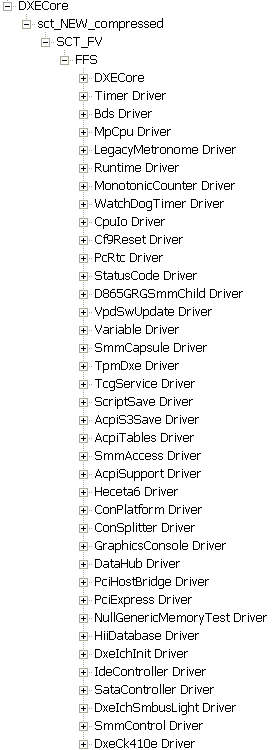
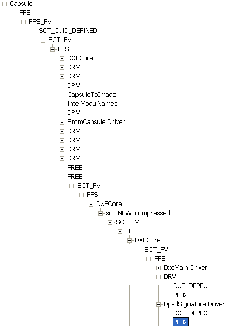
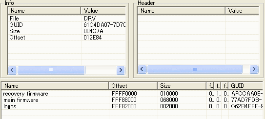

# EFI

## Структура EFI  

В BIOS для каждого модуля имеется "заранее" прописанное место назначения/распаковки, которое или берётся из его заголовка напрямую, либо определяется его ID.  
В EFI же модули не имеют подобной привязки и за их распаковку/загрузку/расположение в памяти отвечает соответствующий менеджер, действуя по собственному алгоритму.  

EFI, в отличие от BIOS может быть представлен в двух вариантах:  
* в качестве «обычного» образа для прошивки (с «кратным» объёмом)  
* в качестве «капсулы», имеющей «неровный» объём, обычно чуть более мегабайта (но не обязательно – может быть 4Мб и больше)  

**Капсула EFI**, как не сложно догадаться из названия - инкапсулирует в себе много различных компонентов, из которых, собственно, прошивальщик "на лету" собирает конечный образ EFIBIOS.  
Увидеть всё это хозяйство (кучу файлов/модулей в составе капсулы) можно с помощью **BIOS Patcher**.  

Определить капсулу просто – в самом её начале будет (самые первые 16 байт):  
```BD 86 66 3B 76 0D 30 40 B7 0E B5 51 9E 2F C5 A0```  
Это её (капсулы) GUID, уникальный 16-байтный идентификатор, который имеют все структуры (т.е. не только модули, но и любые упорядоченные нужные данные) в EFI.  

Cтруктурe капсулы можно найти в исходниках:  
```
typedef struct {
  EFI_GUID  CapsuleGuid;
  UINT32    HeaderSize;
  UINT32    Flags;
  UINT32    CapsuleImageSize;
  UINT32    SequenceNumber;
  EFI_GUID  InstanceId;
  UINT32    OffsetToSplitInformation;
  UINT32    OffsetToCapsuleBody;
  UINT32    OffsetToOemDefinedHeader;
  UINT32    OffsetToAuthorInformation;
  UINT32    OffsetToRevisionInformation;
  UINT32    OffsetToShortDescription;
  UINT32    OffsetToLongDescription;
  UINT32    OffsetToApplicableDevices;
} EFI_CAPSULE_HEADER;
```

Компоненты EFI могут быть как скомпилированными, так и в открытом виде - Open Sources (например tianocore.org, uefi.org).  

Структура EFI-капсулы может обновлятся и меняться (новые спецификации).  

Капсула – как матрёшка. В ней есть другие матрёшки, которые могут содержать внутри себя ещё матрёшки и так далее. В этом есть важное отличие – в стареньком BIOS подобной «рекурсии» не наблюдается.  

**FFS (Firmware File System)** – есть «чисто» матрёшка, которая позволяет помечать нужную часть собственной «биркой» (т.к. имеет свой GUID):  
```
//
// FFS file header definition
//
typedef UINT8 EFI_FFS_FILE_ATTRIBUTES;
typedef UINT8 EFI_FFS_FILE_STATE;

typedef struct {
  EFI_GUID                Name;
  EFI_FFS_INTEGRITY_CHECK IntegrityCheck;
  EFI_FV_FILETYPE         Type;
  EFI_FFS_FILE_ATTRIBUTES Attributes;
  UINT8                   Size[3];
  EFI_FFS_FILE_STATE      State;
} EFI_FFS_FILE_HEADER;
```
**FFS** или дальше просто «файл» в нашей системе – есть «обёртка» для **FV (Firmware Volume)**.  
А вот именно FV уже являются важнейшими для нас матрёшками, внутри них содержится «логически законченный» набор блоков/модулей. К примеру, PreEFI (аналог BootBlock для BIOS). Или FV ядра, где содержатся модули основной стадии (аналог POST для BIOS), который, кстати, может содержать сотни вложенных файлов-модулей.  

  

Структура «раздела» (**FV**):  
```
//
// Firmware Volume Header definition
//
typedef struct {
  UINT8                   ZeroVector[16];
  EFI_GUID                FileSystemGuid;
  UINT64                  FvLength;
  UINT32                  Signature;
  EFI_FVB_ATTRIBUTES      Attributes;
  UINT16                  HeaderLength;
  UINT16                  Checksum;
#if (PI_SPECIFICATION_VERSION < 0x00010000)
  UINT8                   Reserved[3];
#else
  UINT16                  ExtHeaderOffset;
  UINT8                   Reserved[1];
#endif
  UINT8                   Revision;
  EFI_FV_BLOCK_MAP_ENTRY  FvBlockMap[1];
} EFI_FIRMWARE_VOLUME_HEADER;
```

В ней как раз уже можно заметить совместимость с предыдущими версиями EFI. В данном случае это не принципиально, т.к. всё очевидно и не оно влияет на длину, однако так не всегда.  
На этом вложенность не заканчивается, я бы даже сказал – только начинается, т.к. FV – тоже, в принципе, можно обозвать лишь «обёрткой». Внутри разделов располагаются секции, которые бывают разные, потому имеют разные заголовки, но неизменяемая их начальная часть имеет следующий вид:
```
//
// Common section header
//
typedef struct {
  UINT8 Size[3];
  UINT8;
} EFI_COMMON_SECTION_HEADER;
```
Как можно догадаться байт типа (Type) определяет, что это за секция и какие внутри неё будут данные. Внутри секций уже снова могут располагаться файлы, разделы, снова секции (вложенные в предыдущие «матрёшки» и т.д. Подобная вложенность может достигать десятого и более уровней…  



Однако главной единицей информации является «модуль». Он содержится внутри секций (если нет вложений). Тип секции описывает тип вложенного в неё модуля, которые бывают разными (больше десятка видов), но наиболее распространёнными являются PE32-модули. Это, как видно из названия - PE32-файлы и по сути являются «нормальными» dll-ками лишь со слегка изменёнными заголовками. Данный факт сразу проливает много на всю суть EFI, которая имеет внутри себя по большому счёту набор «почти виндовых» dll-ок. А раз это dll-ки, то и механизмы их обработки/подгрузки/защиты – схожие.  

## AMI Aptio

#### Структура

Прошивка состоит из томов (FirmwareVolume). Драйверы (DXE_DRIVER) исправно прогружаются из тома с драйверами и DXE_CORE.  

Из особенностей - тома могут быть сжаты и находиться в других томах в виде файла (FIRMWARE_IMAGE).  

Используемые типы сжатия:  
* EfiCompression - в edk2 см. BaseTools/Source/C/Common/{EfiCompress,Decompress}.c  
* LZMA из 7z SDK - в edk2 см. BaseTools/Source/C/LzmaCompress  

Документы:  
* "Intel® Platform Innovation Framework for EFI. Firmware Volume Specification"  
* "UEFI Platform Initialization Specification. Pre-EFI Initialization Core Interface"  

Представители:  
* ASUS  
* MSI  
* Desten (некоторые)  
* Panasonic  
* ТОНК  

Некоторые UUID:  
```
    /* Mtftp6Dxe */
    "61afa251-8ac8-4440-9ab5-762b1bf05156",
    /* Dhcp6Dxe */
    "8dd9176d-ee87-4f0e-8a84-3f998311f930",
    /* Udp6Dxe */
    "10ee54ae-b207-4a4f-abd8-cb522ecaa3a4",
    /* Ip6Dxe */
    "8f92960e-2880-4659-b857-915a8901bdc8",
```

## Hybrid EFI  

http://www.rodsbooks.com/gb-hybrid-efi/  

## Insyde H2O

Аналогично AMI Aptio. При этом всё, что после PEI, находится в большом жатом DXE_CORE.  
На некоторых устройствах прошивка подписана.  

Представители:  
* Acer  
* HP (предположительно)  
* SONY (предположительно)  

## Редактирование BootBlock

BootBlock обычно имеет стандартный размер в 64Кб (10000h или Size: 010000), однако не факт - уже сталкивался с бутблоком на 256Кб на новых платах с EFI.  
Другим точным указанием на то, что это именно BootBlock - есть наличие в составе FFS модуля (тип RAW) с названием SecCore Driver.  

Далее непринуждённо тыкаем кнопку "Сохранить как" и получаем на выходе нужный код BootBlock.  

Восстановить с помощью этого файла оригинальный BIOS уже дальше дело техники. Кто внимательно читал "Искусство перешивки BIOS" тому это будет совсем просто. Полученный код с помощью любого hex-редактора вставляем в самый конец "заготовки" прошивки (пустой файл, равный по объёму требуемой прошивке). Прошиваем и получаем ошибку CRC BIOS, срабатывает аварийная процедура восстановления BIOS (которая располагается в оживлённом нами BootBlock-е) и после стандартных шаманских действий в такой ситуации на выходе получаем рабочий компьютер.  

## Сборка прошивки

Ищем модуль CapsuleToImage.  



Теоретически в окне справа оного должна быть отображена информация о составных частях прошивки и адресах, по которым нужно их расставлять.  
С учётом 8-Мегабитности прошивки приведённого примера, что обозначает, что начальный адрес оной в памяти есть FFF80000, несложно (хотя, может, и сложно) догадаться, что в недрах капсулы нужно найти три части и записать их по адресам 70000, 8000 и 2000 соответственно.  
Исходя из названия логично, что:  
* recovery firmvare - есть ранее нами уже рассекреченный бутблок (поэтому и пишется в конец)  
* main firmware - основной код BIOS (кликуха - DXE Core или POST по-нашенски)  
* logos - и прочие подобные файлы (их может не быть) есть просто дополнительная мишура, полноэкранная заставка в данном случае  
У каждой из частей отображается её GUID по которому можно безошибочно извлечь нужный FFS. С помощью того же hex-редактора записываем выделенные куски по нужным адресам в "заготовке" прошивки и на выходе получится заветный образ.  

