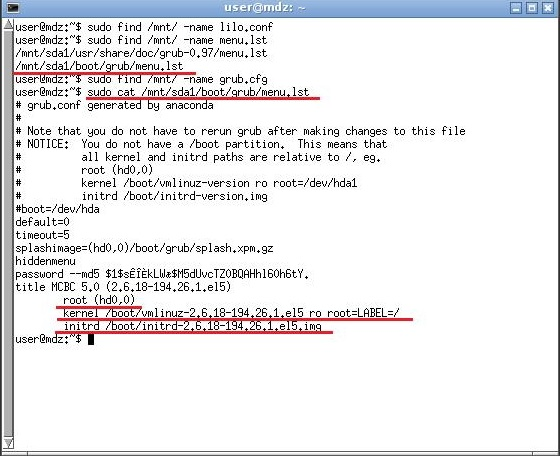
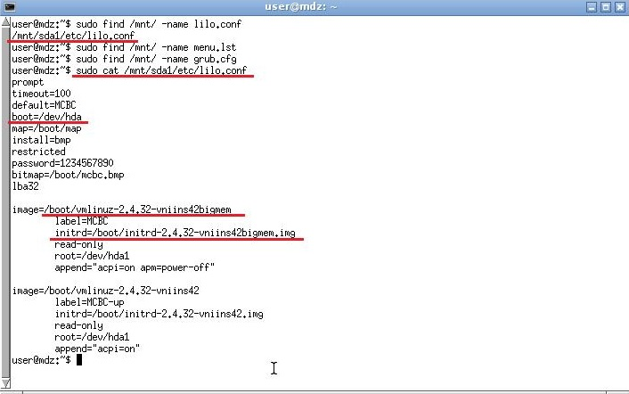

# Загрузчик  

## MBR

Выбрать загрузочную область жесткого диска и загрузиться в режиме совместимости.  

## GPT

Выбрать раздел с EFI ("EFI SYSTEM PARTITION", ESP) и указать путь до загрузочного файла:  
```/EFI/Boot/boot.efi```  
Пример-1:  
```
set root=(hd1,msdos1)
chainloader /EFI/Microsoft/Boot/bootmgfw.efi
boot
```

## Передача процедуры другому загрузчику  

Выбрать раздел с другим загрузчиком и передать ему управление, при помощи команды "chainloader +1".  
Пример-1:  
```
set root=(hd1,msdos3) # устанавливаем root диск
chainloader +1 # передаем управление
boot # подаем команду на запуск
```
Пример-2:
```
Insmod ntfs
search –u "UUID диска" –s
chainloader +1
boot
```
## ОС Windows


## ОС Linux

В ОС семейства Linux в основном используются три типа загрузчика: Lilo, Grub и Grub2  
Конфигурационные файлы загрузчиков находятся в следующих каталогах:  
* lilo: /etc/lilo.conf  
* grub: /boot/grub/menu.lst  
* grub2: /boot/grub/grub.cfg  

В МДЗ использует загрузчик GRUB. Нумерация физических дисков начинается с нуля, а нумерация разделов начинается с единицы. Первый физический диск (sda в системе) обозначается "hd0", второй (sdb) - "hd1", и так далее. Нумерация разделов диска будет выглядеть следующим образом: первый раздел первого диска (sda1) - "hd0,msdos1", четвертый (sda4) - "hd0,msdos4".  

Для загрузчика GRUB2:  
* linux ... – загрузка ядра  
* initrd ... – загружает указанный initrd образ  
Для загрузчика GRUB:  
* kernel... – загрузка ядра  
* initrd ... – загружает указанный initrd образ  
Для загрузчика LILO:  
* image =... – файл образа ядра  
* initrd =... – загружает указанный initrd образ  

  

  

Пример-1:
```
search –u "UUID диска" –s
linux /boot/kernel root=UUID="UUID диска" or quiet splash
initrd /boot/initrd.img
boot
```

| Название и версия ОС | Legacy/EFI | Текст сценария запуска |
| - | - | - |
| WindowsXPx86 | Legacy | Загрузочное устройство /dev/sda[mbr], chainloader +1 |
| Windows7x32 | Legacy | Загрузочное устройство /dev/sda[mbr], chainloader +1 |
| Windows7x64 | Legacy | Загрузочное устройство /dev/sda[mbr], chainloader +1 |
| Windows7x64 | EFI | Загрузочное устройство /dev/sda1[vfat], chainloader /EFI/Microsoft/Boot/bootmgfw.efi |
| Windows8x32 | Legacy | Загрузочное устройство /dev/sda[mbr], chainloader +1 |
| Windows8x64 | Legacy | Загрузочное устройство /dev/sda[mbr], chainloader +1 |
| Windows8x64 | EFI | Загрузочное устройство /dev/sda1[vfat], chainloader /EFI/Microsoft/Boot/bootmgfw.efi |
| Windows10x32 | Legacy | Загрузочное устройство /dev/sda[mbr], chainloader +1 |
| Windows10x64 | Legacy | Загрузочное устройство /dev/sda[mbr], chainloader +1 |
| Windows10x64 | EFI | Зарузочное устройство /dev/sda1[vfat], chainloader/EFI/Microsoft/Boot/bootmgfw.efi |


Часто используемые команды:  
| Команда | Описание |
| - | - |
| ls | При использовании в чистом виде выдает список жестких дисков и разделов.<br>Также она может быть использована как одноименная команда в Linux - для вывода содержимого каталога.<br>Например: ls /boot/grub выведет содержимое каталога "/boot/grub" на разделе, который сейчас указан в качестве корневого.<br>Также ее можно использовать для получения информации о любом разделе: ко-манда ls (hd1,msdos1) сообщает тип файловой системы на разделе, метку раздела (если таковая имеется), UUID и дату последнего изменения данных на разделе (в формате UTC). |
| cat | Данная команда аналогична команде в linux и она выводит содержимое заданного файла.<br>Синтаксис: cat /путь/имя_файла |
| linux | Загружает указанное linux-ядро. Аналог команды "kernel" в grub-legacy.<br>Синтаксис: linux файл_ядра опция1=значение опция2 опция3<br>Пример: linux /boot/vmlinuz-2.6.32-020632-generic root=/dev/sda5 single |
| initrd | Загружает указанный initrd-образ.<br>Пример: initrd /boot/initrd.img-2.6.32-020632-generic<br>Обратите внимание: версия initrd должна соответствовать версии загружаемого ядра! |
| chainloader | Передает управление загрузкой по цепочке другому загрузчику (загрузчик ищется на заданном в качестве root разделе).<br>В общем случае требует указания файла для загрузки: chainloader /путь/имя_файла<br>Для NTLDR (загрузчика Windows) можно использовать: chainloader +1 |
| boot | Производит загрузку указанного ядра (заданного с "linux" и "initrd") или же другого загрузчика (заданного через "chainloader"). Используется без параметров. |
| root | При использовании без параметров сообщает, какой раздел сейчас используется в качестве корневого (по умолчанию - корневой раздел системы, на которую установлен те-кущий grub) и тип файловой системы на этом разделе. Также команда может быть использована для задания другого root-раздела. Раздел задается в "grub device" формате, то есть "(hd*,*)".<br>Рекомендуется использовать так: set root=(hd0,msdos1) |
| set | Весьма универсальная команда для изменения различных параметров. Служит для задания значений переменных.<br>Синтаксис: set переменная=значение<br>Наиболее необходимое ее применение, это задания root-раздела. Для этого изменяется переменная "root", в качестве значения задается необходимый раздел, например: set root=(hd0,msdos1). |
| search | Одна из самых полезных команд. Потомок "find" и "uuid" из grub-legacy. Служит для поиска раздела по UUID, метке или заданному файлу.<br>Имеет следующие ключи:<br>-u (или --fs-uuid) - поиск раздела по UUID;<br>-l (или --label) - поиск по метке раздела;<br>-f (или --file) - поиск по указанному файлу;<br>-n (или --no-floppy) - не проверять флоппи-дисковод;<br>-s (или --set) - установить найденный раздел в качестве значения заданной пере-менной.<br>При подключении/отключении жестких дисков (и в некоторых других случаях) нумерация дисков и разделов может поменяться, и тогда команда "set root=(hd0,msdos1)" в "grub.cfg" будет вести или в никуда или на раздел не того диска. Для поиска раздела с известным uuid необходимо запустить "search" с ключом "-u": search -u uuid_нужного_раздела – данная команда сообщит, какой раздел соответствует заданному UUID.<br>Также можно найти boot-раздел системы. Сделать это можно по файлу "grub.cfg": search -f /grub/grub.cfg При использовании такого способа указанный файл должен иметь-ся только на одном разделе! Получив искомое, можно вручную задать нужный раздел в качестве root-раздела, но гораздо проще воспользоваться ключом "-s". Если после него не указана переменная, будет использована "root", то есть найденный раздел как раз и будет задан в качестве корневого. Допустим, раздел с Windows имеет метку "C_drive". Установить его в качестве корневого для загрузки с него можно командой: search -l C_drive -s<br>Командой "search" можно заменить команду “set root”. |
| help | При использовании в чистом виде выведет список доступных команд.<br>Пример 1: help r - выведет справку по всем командам, начинающимся на "r".<br>Пример 2: help search - отобразит справку по команде "search". |
| halt | Выключит компьютер |
| reboot | Перезагрузит компьютер |
| configfile | Потомок одноименной команды в grub-legacy. Позволяет загрузить другой файл конфигурации с другим меню вместо текущего "grub.cfg".<br>Синтаксис: configfile /путь/другой_файл_меню |
