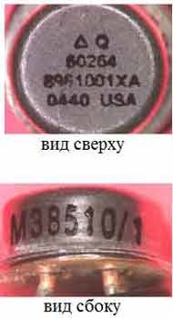
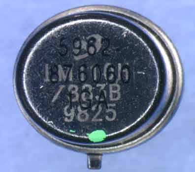
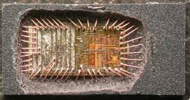
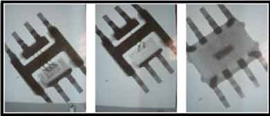

# Подделка электроники

## Виды подделки электроники

### 1. Повторное использование изделий

Вышедшая из эксплуатации электроника разбирается на запасные части, а затем продаются под видом новых:  
* с помощью специального оборудования, демонтированные компоненты приводятся к торговому виду
* стирается старая надпись, создается матовая поверхность, наносится новая надпись, подобная той которая была, чистятся и создаются «не паянные выводы», и т.д.
* компоненты перемаркируются с целью исправить год производства микросхемы, уровень качества и т.д.
Доп. материалы 1: https://www.youtube.com/watch?v=r4MrRsYXTNM  
Доп. материалы 2: https://www.youtube.com/watch?v=5AYT0dwvF6g  

### 2. Клонирование
Создание копий продукта.

### 3. Использование изделий с браком
Изделия, не прошедшие контроль на дефекты, но имеющие не критические проблемы происходит отключение компонентов или модулей, если технически это возможно.

### 4. Микросхемы с другим кристаллом
В микросхему установлен другой кристалл с худшими характеристиками или с закладкой.  

## Обнаружение подделки
Основные методы обнаружения поддельных компонентов можно разделить на физические и электрические. Физические методы включают в себя идентификацию, контроль маркировки, контроль массогабаритных параметров, рентгенологическое обследование, контроль герметичности, сканирующая акустическая микроскопия. К электрическим методам относят параметрический контроль, функциональный контроль, электротермотренировку. контроль электрических параметров по ужесточенным нормам проверку однородности партии.  

Комплексный набор испытаний должен включать в себя такие этапы, как проверка физических размеров, проверка постоянства всех маркировок, рентгеновские и электрические испытания. Электрические параметры должны проверяться на граничных температурах.

Проверка маркировки может включать в себя:  
* Некорректная маркировка (например, неверный код даты, орфографические ошибки, просвечивающая старая маркировка);
* Низкое качество маркировки;
* Маркировка смывается после воздействия растворителей.

   

Так же для контроля маркировки используют акустический микроскоп. В методах акустической микроскопии используются упругие механические колебания, обеспечивающие распространение волн в твердой среде.  

Для выявления несоответствий кристалла и внутренних соединений так же используется разрушающий физический анализ (РФА). РФА проводится на выборке и является разрушающим методом. В процессе РФА происходит декапсуляция образца и оценка внутреннего состояния компонента
  

Скрытые дефекты внутри компонентов выявляют рентгенографическим оборудованием.  
  
Рентгенографический контроль определяет наличие кристалла, постоянный размер/форма кристалла, целостность внутренних соединений, точное расположение кристалла и разводки.  

Доп. материалы 3: https://www.youtube.com/watch?v=uK-hKOkoKAI  
Доп. материалы 4: https://www.youtube.com/watch?v=5Ku7I3hA3AA  
Доп. материалы 5: https://www.youtube.com/watch?v=OaBRak0HnQs  
