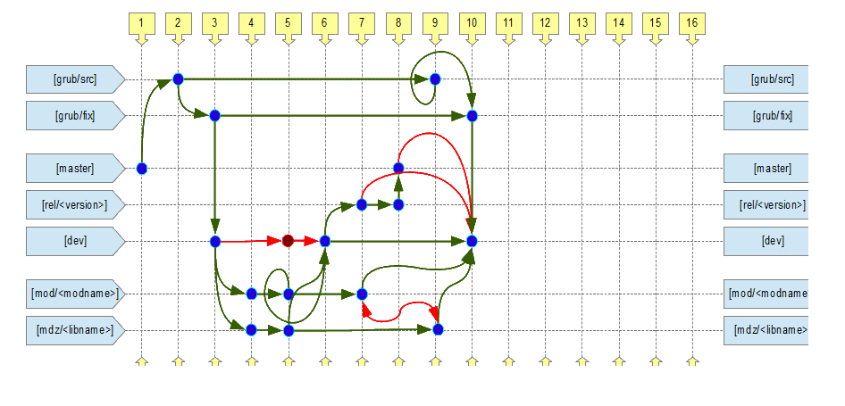

# Пример 1

Концепт работы в репозитории git в стиле 'git must flow'.  

  

## Описание ветвей  

* **grub/src**  
> Ветка для содержания базовой версии GRUB.  
> Вливание: только из внешних источников.  
> Разработка: запрещена. Только полная смена на новый релиз, когда он выходит.  
> Сливание: только в grub/fix для последующих корректировок  

* **grub/fix**  
> Ветка для патченного GRUB-а. Например с отключенным лицензированием или еще чем-то таким глобальным. Переделанными makefile-ами...  
> Вливание: только с grub/src  
> Разработка: допустима, желательно без ветвлений. Всякие патчи и костыли.  
> Сливание: только в dev  

* **dev**  
> Ветка разработки. Здесь смешивается воедино самая последняя unstable-версия МДЗ.  
> Вливание: только оно и нужно. Из веток с базой (grub/fix) и модулей (mod/... + mdz/...)  
> Разработка: запрещена. Эта ветка - только для сборки системы воедино. Все правки должны быть в своих ветках.  
> Сливание: разрешено в rel/... когда работает уже стабильно и готова к пред-релизу и в mod/... для обновления базы.  
> Параметры: всегда --no-ff !  

* **mod/...**  
> Ветка разработки дополнительного модуля для GRUB.  
> Вливание: из dev. из соседних веток модулей - запрещено. нужна изоляция.  
> Разработка: ну тут без неё никак. По хорошему модуль тут варится.  
> Сливание: в dev. Когда модуль доведен до кондиции и как минимум компилируется.  

* **mdz/...**  
> Разновидность mod/..., только тут всякая статика типа хедеров, статических либ и как костыль - со старым набором МДЗ.  
> Вливание: см. mod/...  
> Разработка: см. mod/...  
> Сливание: см. mod/...  

* **rel/...**  
> Предрелизные версии. Когда уже кажется что все хорошо, но подводные камни присутствуют. Тут тестинг и патчи по его результатам.  
> Вливание: из dev, когда та доведена до кондиции.  
> Разработка: всякие патчи - и то под вопросом.  
> Сливание: в master  

* **master**  
> Ветка, в которой находятся релизные версии МДЗ aka production.  
> Вливание: из dev, когда та доведена до кондиции.  
> Разработка: нежелательно. только экстренные фиксы какие-нибудь.  
> Сливание: никуда не надо. это уже самое лучшее что есть.  

## Примеры транзакций  

**01: Инициализация репозитория**  
```
git commit --allow-empty master
```
**02@grub/src, 09@grub/src: Загрузка оригинала GRUB**  
```
git checkout grub/src
##delete everything##
##put new version##
git add -A
git commit -a
```
**02@grub/src -> 03@grub/fix: Вливание базы для препарирования**  
```
git checkout grub/fix
git merge --no-ff [--no-commit] -s recursive -X theirs grub/src
[git commit -a -m 'message']
```
**03@grub/fix -> 03@dev: Вливание новой базы в работу**  
```
git checkout dev
git merge --no-ff [--no-commit] -s recursive -X theirs grub/src
[git commit -a -m 'message']
```
**03@dev -> 04@mod/...: Начинается новый модуль**  
```
git checkout -b mod/... dev
##добавляем файлы##
git add -A
git commit -a
```
**04@mod... -> 05@mod/...: Правка модуля**  
```
##work-work-work##
git commit -a
```
**05@mod... -> 06@dev: Вливание модуля в разработку**  
```
git checkout dev
git merge --no-ff --no-commit mod/<mod1> [mod/<mod2> ... #octopus merge]
##проверка не испортили ли чего + резолюция конфликтов##
git commit -a
```
**06@dev -> 07@rel/...: Предрелиз для тестов**  
```
git checkout -b rel/<version>
git merge --no-ff -s recursive -X theirs dev
```
**07@rel/... -> 08@rel/...: Какой-то патч для бага, обнаруженного при тестах**  
```
git commit -a ## :)
```
**08@rel/... -> master: Релиз**  
```
git checkout -b master
git merge --no-ff -s recursive -X theirs rel/<version>
git tag <version> # Достойно лычки
```
**10@dev -> Замес свеженького МДЗ**  
см. 05@mod... -> 06@dev  

## Разборка разноса по веткам  
Сложилось так, что есть личная ветка usr в которой творятся немыслимые извращения, но она попала на сервер.
Теперь задача - выковырнуть лишь необходимое из личной ветки, вставить в ветки модулей и собрать на dev всё.  
```
usr) git commit -a
usr) git checkout mod/modbranch
mod/modbrach) git cherry-pick <commit-id-on-usr>
mod/modbrach) git reset
mod/modbrach) git commit -m "blah" <list of files>
mod/modbrach) git checkout -f dev
dev) git merge ...
```

## Разбор из общей ветки по модулям  
Забыл / было лень / не захотел переключиться на ветку модуля и разработал все в общей. Как разложить по полкам?  
1. Не надо коммитить!  
2. Слить все в "схрон" ```git stash```  
3. Ветка очистится и можно ```git checkout mod/mod1```  
4. Накатываем нашу работу ```git stash apply```  
5. Получаем грязюку. Чистим грязюку при помощи такой самопальной команды:  
```
# put me in /usr/local/bin/git-rm-unmerged && chmod a+x /usr/local/bin/git-rm-unmerged
#!/bin/bash
for removeme in $(git status -s | grep 'DU' | awk '{ print $2; }'); do
    git-rm $removeme
done
```  
выполняя ```git rm-unmerged```  
( Можно и руками это все сделать, но не когда миллион файлов несмержились )  
6. Проверяем, коммитим ```git commit -a ```  
7. Повтор пунктов 3-6 для следующих веток модулей  
8. Когда все распределили и закоммитили - чистим схрон ```git stash clear```  
