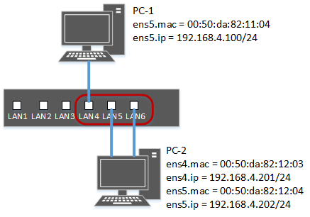

# Генерация сетевого трафика с адресацией: unicast, broadcast, multicast

## Схема стенда

  

## Генерация unicast
Сетевые пакеты должны выходить с сетевого интерфейса PC-1.ens5 и приходить только на сетевой интерфейс PC-2.ens4 [или PC-2.ens5].  
### Скрипт:
```
import scapy.all as scapy

eth = scapy.Ether()
eth.type = 0x0800
eth.src = '00:50:da:82:11:03'
eth.dst = '00:50:da:82:12:03'

ip = scapy.IP()
ip.proto = 1
ip.src = '192.168.4.100'
ip.dst = '192.168.4.201'

icmp = scapy.ICMP()
icmp.type = 8
icmp.seq = 1

data = scapy.Raw(load='test messange')

pkg = eth/ip/icmp/data

print(pkg.show2())

scapy.sendp(pkg, iface='ens5')
```
Сетевой пакет:
```
###[ Ethernet ]###
  src       = 00:50:da:82:11:03
  dst       = 00:50:da:82:12:03
  type      = IPv4
###[ IP ]###
     version   = 4
     ihl       = 5
     tos       = 0x0
     len       = 41
     id        = 1
     flags     =
     frag      = 0
     ttl       = 64
     proto     = icmp
     chksum    = 0xf055
     src       = 192.168.4.100
     dst       = 192.168.4.201
     \options   \
###[ ICMP ]###
        type      = echo-request
        code      = 0
        chksum    = 0x437b
        id        = 0x0
        seq       = 0x1
###[ Raw ]###
           load      = 'test messange'
```

## Генерация broadcast
Сетевые пакеты должны выходить с сетевого интерфейса PC-1.ens5 и приходить только на сетевой интерфейс PC-2.ens4 и PC-2.ens5.  
### Скрипт:
```
import scapy.all as scapy

eth = scapy.Ether()
eth.type = 0x0800
eth.src = '00:50:da:82:11:03'
eth.dst = 'ff:ff:ff:ff:ff:ff'

ip = scapy.IP()
ip.proto = 1
ip.src = '192.168.4.100'
ip.dst = '192.168.4.255'

icmp = scapy.ICMP()
icmp.type = 8
icmp.seq = 1

data = scapy.Raw(load='test messange')

pkg = eth/ip/icmp/data

print(pkg.show2())

scapy.sendp(pkg, iface='ens5')
```
Сетевой пакет:
```
###[ Ethernet ]###
  src       = 00:50:da:82:11:03
  dst       = ff:ff:ff:ff:ff:ff
  type      = IPv4
###[ IP ]###
     version   = 4
     ihl       = 5
     tos       = 0x0
     len       = 41
     id        = 1
     flags     =
     frag      = 0
     ttl       = 64
     proto     = icmp
     chksum    = 0xf01f
     src       = 192.168.4.100
     dst       = 192.168.4.255
     \options   \
###[ ICMP ]###
        type      = echo-request
        code      = 0
        chksum    = 0x437b
        id        = 0x0
        seq       = 0x1
###[ Raw ]###
           load      = 'test messange'
```

## Генерация multicast
Сетевые пакеты должны выходить с сетевого интерфейса PC-1.ens5 и приходить только на сетевой интерфейс PC-2.ens4 и PC-2.ens5.  
### Скрипт:
```
import scapy.all as scapy

eth = scapy.Ether()
eth.type = 0x0800
eth.src = '00:50:da:82:11:03'
eth.dst = '01:00:5e:00:00:01'

ip = scapy.IP()
ip.proto = 1
ip.src = '192.168.4.100'
ip.dst = '224.0.0.1'

icmp = scapy.ICMP()
icmp.type = 8
icmp.seq = 1

data = scapy.Raw(load='test messange')

pkg = eth/ip/icmp/data

print(pkg.show2())

scapy.sendp(pkg, iface='ens5')
```
Сетевой пакет:
```
###[ Ethernet ]###
  src       = 00:50:da:82:11:03
  dst       = 01:00:5e:00:00:01
  type      = IPv4
###[ IP ]###
     version   = 4
     ihl       = 5
     tos       = 0x0
     len       = 41
     id        = 1
     flags     =
     frag      = 0
     ttl       = 64
     proto     = icmp
     chksum    = 0xf055
     src       = 192.168.4.100
     dst       = 224.0.0.1
     \options   \
###[ ICMP ]###
        type      = echo-request
        code      = 0
        chksum    = 0xd5c5
        id        = 0x0
        seq       = 0x1
###[ Raw ]###
           load      = 'test messange'
```
