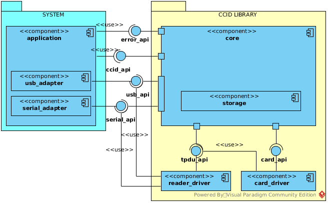
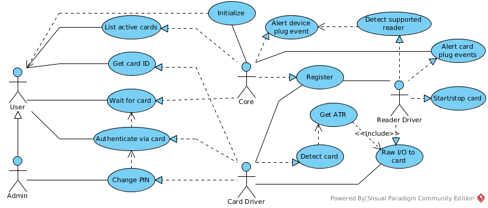
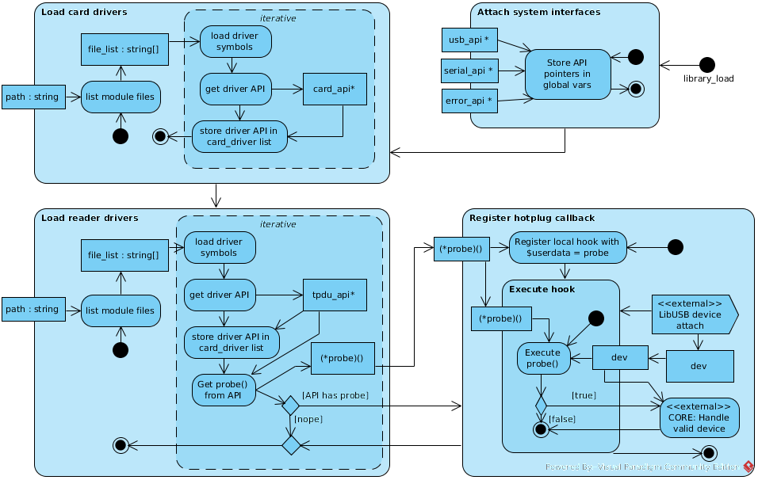
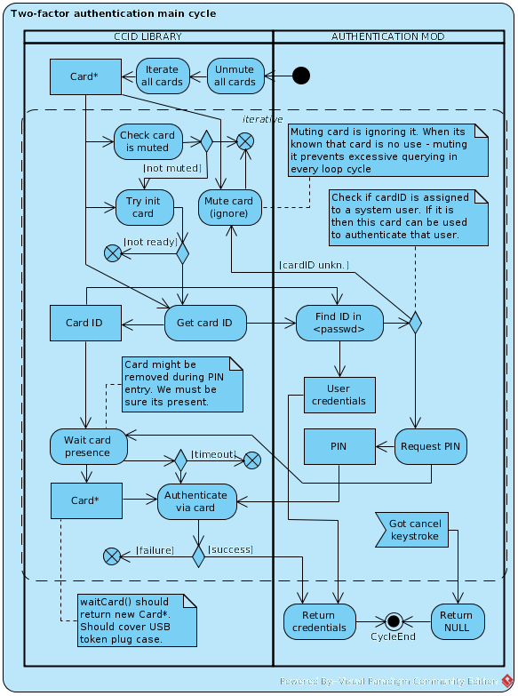

# libsetoken

libsetoken - кросс-системная библиотека предоставляющая обобщенный прикладной интерфейс для высокоуровневой работы с токенами разных производителей, моделей и форм-факторов. Предоставляемый интерфейс покрывает необходимые функции для обеспечения поддержки двухфакторной аутентификации в приложениях-клиентах, её использующих.  

libsetoken - кросс-системная библиотека (единый код может быть подключен как к загрузчику так и к конфигуратору) предоставляющая обобщенный прикладной интерфейс для высокоуровневой работы с токенами разных производителей, моделей и форм-факторов, таких как:  
* Смарт-карты (обеспечивается работа с ридерами смарт-карт по ISO 7816-4)  
* USB-токены - жесткая связка CCID reader + card по ISO 7816-4  
* USB-токены устаревшие - по проприетарным протоколам  
* iButton - работа с контроллером 1-Wire  

Поддерживается протоколы уровня APDU токенов следующих видов:  
* ~~Aladdin eToken LT, PKI, ГОСТ~~  
* Aktiv ruToken S, ECP, ECPv2  
* ~~iButton DS1990 - таблетка только с идентификатором~~  
* ~~iButton DS199[2,3,4] - таблетки с открытой памятью~~  
* ~~iButton DS1961 - таблетки с механизмом защиты~~  

Поддержка двухфакторной аутентификации обеспечивается предоставлением следующих возможностей:  
* обнаружение и перечисление подключенных к системе токенов  
* начало и завершение работы с выбранными токенами  
* идентификация токенов  
* аутентификация с помощью токенов (если поддерживается)  
* получение информации о состоянии счётчиков неудачных попыток (если поддерживается)  
* обработка блокировки доступа по превышению попыток (снятие, сброс токена к заводскому состоянию)  
* управление ПИН-кодом(ами) доступа на токене (если поддерживается)  
* работа с метками токенов (если поддерживается)  

## Архитектура libsetoken

  

#### **Ядро - Core (поддиректория setoken)**  
Данный модуль занимается следующим:  
1. управление памятью - для нужд плагинов ядро выделяет память для хранения контекстных данных, также выделяет память под объекты типа tkn_card_t, складывает их в списки, удаляет при необходимости  
2. обрабатывает возникающие ошибки, оповещает клиента (см. error_api)  
3. хранит и раздаёт аппаратные интерфейсы модулям  
4. обеспечивает общую логику функционирования на протяжении всей жизни карты  
5. предоставляет функции для конструирования/парсинга APDU данных по заранее заданным шаблонам  

#### **Инициализация**

  

  

Для работы библиотеки система клиент должна предоставить #API_USB и/или #API_SERIAL интерфейсы-адаптеры, приводящие системно-специфическое поведение к поведению в соответствие с потребностью libsetoken. Осуществляется с помощью вызова tkn_access_usb(new_USB_API) и/или tkn_access_serial(new_SERIAL_API).  
Для получения уведомлений об ошибках и/или отладочных сообщениях клиент должен указать адрес функции (коллбек) принимающей соответствующее сообщение через аргумент типа const char\*.  
Непредоставление того или иного интерфейса - не должно позволять загрузку модулей драйверов <reader_driver>, которые полагаются на эти интерфейсы.  
Далее требуется подключить модули поддержки считывателей (libmod_*.so) и карт (libcrd_*.so). Указатели на API, предоставляемые модулями считывателей регистрируются во внутреннем списке "tpdu", а указатели на API драйверов карт в списке "cardos"  

Загрузка драйверов карт рекомендована до загрузки драйверов ридеров. Поскольку при загрузке последних осуществляется пробание обнаруженных карт карто-драйверами.  

Библиотека при вызове #tkn_update() опрашивает все доступные устройства через все предоставленные API считывателей.  
Для каждого обнаруженного устройства вызываются функция probe из всех доступных (зарегистрированных) API драйверов считывателей.  
При позитивном результате пробы ядро вызывает функцию перечисления (#enumerate) для данного устройства. Эта функция должна зарегистрировать (#tkn_reg_card()) необходимое количество уникальных карт (например для каждого слота CCID-считывателя, для каждого 1-wire устройства на шине).  
Затем каждая карта пробается драйвером cardOS - и те, которые дают позитивную пробу - тем в tkn_card_t записывается указатель на API обслуживающего драйвера карты и впоследствии эти карты могут быть использованы в функциях аутентификации и идентификации.  

#### **Подключаемые модули**  
Драйвера должны быть полностью пассивными, не делать ничего и предоставлять только структуру с интерфейсом.  
apdu.c - работа с конструктором/парсингом APDU пакетов  
Модуль реализует возможность формирования или парсинга APDU пакетов на основе шаблона, заданным самостоятельным простейшим синтаксисом.  

#### **Типы данных**  
Типы данных объявляются свои, но очень похожи на классические линуксовые.  
Файл types.h в зависимости от системы под которой собирается библиотека - включает файл типов (types/\*.h) либо для линукса либо для grub.  

Типы данных:  
* tkn_card_t  
* rawdata_t  

**CARD_T**  
Основным объектом библиотеки является card_t - структура, адресующая каждый токен. Структура типично состоит из:  
* атипичного указателя на физ. устройство - указатель используется соответствующим системным адаптером при обращениях из драйвера ридера  
* указателя на tpdu_api - интерфейса драйвера ридера, который дал позитивную пробу для данного физ. устройства  
* атипичного указателя на контекст драйвера ридера - область памяти в которой драйвер ридер сохраняет необходимые данные для взаимодействия и адресации каждого токена, который обслуживается данным физ. устройством  
* указателя на card_api - интерфейса драйвера карты, который дал позитивную пробу для конкретного токена, определённого контекстом ридера  
* атипичного указателя на контекст драйвера картОСи - область памяти в которой драйвер картОС сохраняет необходимые данные о состоянии карты, кеша и проч.  

**RAWDATA**  
Сводное представление бинарных данных, со встроенным хранением длины данных. Это составной тип содержащий:  
* беззнаковую длину данных  
* атипичный указатель на сырые данные  

Структура уплотнена, поэтому данные передаются по указателю. Удобен тем, что имеет три состояния:  
* rawdata\* NULL - обычно означает ошибку при формировании данных  
* Данные с длиной 0 - означают, что ошибок не произошло, но никаких данных нет  
* Данные с длиной > 0 - означает, что данные успешно сформированы и с ними можно работать  

**Lists**  
Написан собственный движок работы с двусвязными списками.  
Идея внешнего интерфеса такова, что хранение списков инкапсулировано в соотв. модуле, а интерфейс для работы с ними реализуется через передачу идентификатора списка, который всегда должен быть фиксированным строковым литералом (const char \*).  

Таким образом есть два типа элементов:  
* метаданные списка (struct list) - структура, содержащая тэг, курсор, указатель на начало списка и прочее такое, что не связано непосредственно с элементами данных.  
* элементы списка (struct list_item) - двухсвязные структуры, которые содержат указатель на сырые данные (rawdata). Непосредственно данные элемент не хранит.  

То, что данные отдельно от элемента - оказалось удобно при удалении. Если элемент из списка удаляется, то в первую очередь освобождаются данные и обнуляется указатель. А потом происходит разлинковка его из цепи списка. Однако элемент при этом остаётся и на него указывает курсор. Поэтому возможно от этого выброшенного элемента двинуться вперед или назад - при смещении курсора проверяется что этот элемент был удалён (флаг - rawdata==NULL) и после перемещения - он тоже освобождается.  

Атомарные данные:  
* status - означает тип ошибки, если < 0. Нормальное выполнение - >=0. Если >0 - это может означать длину чего-нибудь.  
* logic - синоним bool  
* dev_handle (void\*) - обезличенный указатель на физическое устройство (usb,serial port). Нужный адаптер приводит это к системному типу  

## Интерфейсы  

## **API_USB**  
**Данный API должен раздавать хэндлы на каждый интерфейс каждого устройства! (как это делает UEFI)**  
Таким образом образуется поддержка комбо-девайсов вида флешка+ccid или клавиатура+ccid и т.д.  

Используемые типы:  
* logic_t - aka bool  
* dev_handle = void\* - то, по чему будет адресоваться индивидуальный интерфейс девайса в соответствие с логикой адаптируемой системы  
* usb_callback = logic(\*)(dev_handle) - коллбек для девайса  

Общие вызовы:
| Вызов | Описание |
| - | - |
| int (\*foreach)(usb_callback test, usb_callback poscb) | Итерация по всем доступным в текущий момент устройствам.<br>- test [opt] - коллбек для пробы. Если он возвращает 0 - девайс неинтересен и хэндл более использован не будет. 1 - наоборот. Если отсутствует, то poscb вызывается для каждого устройства.<br>- poscb [opt] - коллбек вызывается для устройств, где test() возвращает 1 или для всех устройств если test не указан. Если отсутствует - ф-ия просто считает количество позитивных test()-ов.<br>- Возвращает: количество позитивных срабатываний функции test() |
| logic_t (\*validate)(dev_handle dev) | [OPT] Валидация хэндла $dev. Возвращает 1, если устройство всё ещё в системе и его возможно подготовить или оно уже готово к I/O |
| logic_t (\*compare)(dev_handle dev1, dev_handle dev2) | [OPT] Сравнение двух хэндлов. Если два хэндла адресуют один и тот же интерфейс одного и того же устройства - вернуть 1. Если функция отстуствует - считается что идентичность хэндлов - это их равенство. |
| logic_t (\*hotplug_cb)(usb_callback h) | [OPT] Функция-регистратор коллбеков, которые вызываются при появлении новых устройств в системе. Возвращает статус регистрации. |
| logic_t (\*unplug_cb)(usb_callback h) | [OPT] Функция-регистратор коллбеков, которые вызываются при исчезновении устройств из системы. Возвращает статус регистрации. |
| logic_t (\*init)(dev_handle dev) | [OPT] Коллбек вызывается перед началом сессии I/O с устройством $dev. Возврат 1 означает, что устройство $dev сейчас в состоянии готовности к I/O. 0 - какой-то фейл. Отсутствие коллбека значит, что устройство всегда готово к I/O. |
| logic_t (\*fini)(dev_handle dev) | [OPT] Коллбек вызывается в конце сессии I/O с устройством $dev. Возврат означает успех или фейл процедуры перевода устройства в idle состояние. Но обычно всем насрать... |
| logic_t (\*release)(dev_handle dev) | [OPT] Освободить хэндл устройства $dev. Вызывается, когда хэндл $dev более не будет использоваться и устройство надо корректно остановить и освободить хэндл. |
| dev_handle (\*reset)(dev_handle dev) | [OPT] В случае сбоев при init() может дёргаться этот коллбек. Его обязанность - реанимировать сбойное устройство и перевести его в idle состояние.<br>Если реанимация устройства успешна - функция возвращает новый хэндл на устройство (может совпадать с $dev). Если реанимацию выполнить не удалось - возвращает NULL, что означает, что хэндл $dev более не валиден. |

USB-специфичные вызовы:
| Вызов | Описание |
| - | - |
| int (\*devcla)(dev_handle dev) | Возврат класса устройства или если класс 0 (PER-INTERFACE), то класса интерфейса устроства, адресуемого хэндлом $dev |
| rawdata_t (\*descriptor)(dev_handle dev, int desc_id) | Получить полный (все индексы) дескриптор типа $desc_id устройства $dev. Возвращаемое значение требуется освобождать. |
| const rawdata_t (\*ioctrl)(dev_handle dev, int type, int req, int val, int idx, rawdata_t in) | Послать+принять контрольное сообщение устройству с соответствующими параметрами и данными $in. Мелкие проблемы (таймауты, запоры) пытаться разрешить, при критическом сбое вернуть 0. При отстутсвии ответа - rawdata нулевой длины. Возвращаемые данные не освобождаются |
| const rawdata_t (\*iobulk)(dev_handle dev, rawdata_t in) | Послать+принять bulk пакет устройству с данными $in. При необходимости разбить $in на куски нужного размера. Если $in 0 - только прочитать все доступные данные. Мелкие проблемы (таймауты, запоры) пытаться разрешить, при критическом сбое вернуть 0. При отстутсвии ответа - rawdata нулевой длины. Возвращаемые данные не освобождаются |

#### **API_SERIAL**  

Under construction  

#### **API_TPDU**  

| Вызов | Описание |
| - | - |
| logic (\*probe)( dev_handle d ) | Проба. Может ли драйвер обрабатывать устройство $d |
| status (\*enumerate)( dev_handle d ) | Сформировать список токенов, которые обслуживаются устройством $d |
| status (\*init)( card c ) | Подготовить токен $c к обмену данными. |
| status (\*fini)( card c ) | Освободить токен $c после обмена данными. |
| rawdata (\*talk)( card c, rawdata data_in ) | Послать сырой TPDU пакет $data_in и вернуть ответные сырые данные |

#### **API_CARD**

N/A

## Поведенческая информация  

#### **Предоставление системных API**  
Для пощады глаз системный интерфейс внутри модулей может быть вызван как USB->foo().  
На деле USB - это макрос #define USB api_usb(0)  
usb_api\* api_usb(usb_api \*napi) - функция предоставляющая/устанавливающая статический указатель (внутри) на интерфейс USB. Если аргумент !NULL - происходит апдейт указателя.  
Аналогично для остальных интерфейсов.  

#### **Загрузка модулей**  
Модуль может иметь функции CCID_INIT и CCID_FINI (макросы). Очевидно чтобы исполнять код при загрузке и выгрузке модуля.  
В grub - это алиас GRUB_MOD_INIT и \_FINI. В линуксе - ld-специфичные ccid_init() \_\_attribute\_\_((constructor)) и ccid_fini() \_\_attribute\_\_((destructor))  

В INIT обычно необходимо вызвать функцию регистрации соотв. драйвера в ядре. При регистрации функция вернёт указатель на этот же api, который надо сохранить в статической переменной. Для некоторых функций ядра (регистрация карт, дерегистрация драйвера) требуется идентификация вызывающего модуля, которая осуществляется предоставлением этого указателя.  

#### **Обработка hotplug-устройств**  
DRAFT:  
Драйвер регистрирует свой API, который засовывается в список.  
При инициализации ядра библы - она регистрирует общий хук usb_hoplug_hadler().  
При срабатывании этот хук пробегается по всем TPDU и смотрит наличие в api_tpdu функции probe() и её каллит.  
Дальше он же обрабатывает логику ...  
to be continued.  

Подключение к системным событиям появления девайсов:  
Системный адаптер реализует коллбек-конвертер, который преобразует системный формат коллбека USB к формату коллбекса CCID (int cb_adapter(void* dev)).  

Регистрация коллбеков драйверами:  
Коллбеки добавляются в список коллбеков. При вызове  

## Механизм двухфакторной аутентификации в загрузчике  

  

Двухфакторная аутентификация предоставлена в виде функции в модуле AUTH.MOD.  
Функция представляет собой один из механизмов аутентификации.  
Механизмы связаны основной функцией аутентификацией, в которой вызываются все механизмы, пока один не произведёт успешную аутентификацию.  
Признаком успешной аутентификации является возврат функцией ненулевого указателя на структуру, описывающего данные юзера <User credentials>  

Функция осуществляет периодический опрос карт, доступных в момент обращения к ним (сегмент ```<<iterative>>``` на диаграмме)  
Если карта отзывается - у неё запрашивается заводской идентификатор <Card ID>.  
Этот идентификатор ищется в соответствующем поле файла /etc/passwd.  
Если идентификатор обнаружен - запоминается указатель на учётку <User credentials> и начинается аутентификация:  
* На экране запрашивается ввод токенского пин-кода <PIN> для аутентификации уровня пользователя.  
* По окончанию ввода - мы проверяем доступность карты (её могут изъять во время ввода).  
* Если карта недоступна - вызывается процедура ожидания карты <Wait card presence> при которой в течение $timeout секунд ожидается повторное появление карты с таким же идентификатором, каким мы аутентифицировались изначально. Если карта появляется - то идём на следующий шаг, иначе фейлимся и возвращаемся в основной цикл поллинга карты.  
* Ожидание карты также прерываемо с клавиатуры. При прерывании - возобновления цикла опроса.
Если карта доступна - ввёденный код передаётся функции аутентификации, если она возращает true, то функция возвращает учетные данные <User credentials>.  

Если идентификатор карты не обнаружен в списке, то она уходит в блеклист (проект. функция mute(card_t\*)):  
* Цель блеклистинга карты - это минимизация реальных обращений к карте, которая нам не нужна, при каждом повторе опроса списка карт.  
* Перед помещением в блеклист на экран выводится "Неизвестный идентификатор ID %s" (c hex-формой ID карты).  
Если ни по каким картам аутентификация не удалась - цикл опроса повторяется вновь через определенную паузу.
Цикл опроса прерываем вводом с клавиатуры - при прерывании подразумевается отказ от аутентификации токеном и функция возвращает NULL. АUTH.MOD вызывает следующий по порядку механизм аутентификации...  